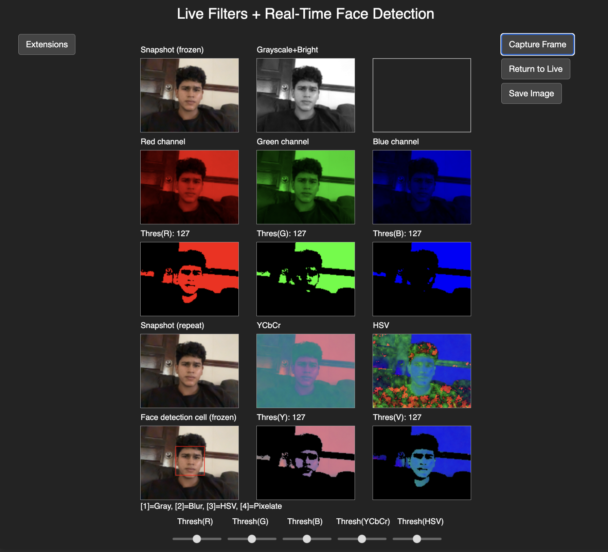

# Image Processing App

[]() []() []() [](LICENSE)

A comprehensive real-time image processing application featuring color space conversions, face detection with privacy filters, and six interactive creative extensions. Built with p5.js for rendering and ml5.js for machine learning models.

## Overview

Image Processing App is an interactive platform for exploring advanced image manipulation techniques using live webcam feeds. The application implements 13 core image processing tasks including RGB channel operations, color space conversions (HSV, YCbCr), image thresholding, and face detection with privacy-preserving filters. Beyond core requirements, six innovative extensions add interactive games, gesture recognition, and creative visual effects.

## Main Interface



## Key Results

| Feature | Details |
|---------|---------|
| **Core Tasks** | 13 image processing operations (tasks 1-13) |
| **Color Channels** | RGB splitting + independent thresholding with sliders |
| **Color Spaces** | HSV & YCbCr conversions with comparative analysis |
| **Face Detection** | ml5.js FaceAPI with bounding box tracking |
| **Privacy Filters** | Grayscale, blur, pixelate (5×5 blocks), color space conversion |
| **ML Models** | 3 models (handpose, faceapi, posenet) in real-time |
| **Extensions** | 6 interactive effects (glitch, gesture, games, filters) |

## What's Inside

**Image Processing:** Live webcam capture, grayscale conversion with brightness enhancement (20%), RGB channel extraction, and independent threshold adjustment for each channel via sliders.

**Color Science:** HSV and YCbCr color space conversions with thresholding comparison, demonstrating luminance/chrominance separation for improved feature isolation.

**Face Privacy:** Real-time face detection with four selectable privacy filters—grayscale conversion, blur (configurable intensity), color space conversion, and advanced pixelation using 5×5 pixel blocks with average intensity calculation.

**Machine Learning:** Integration of three ml5.js pre-trained models—handpose for hand keypoint tracking and gesture recognition, FaceAPI for facial landmark detection and blink recognition, and PoseNet for head position tracking.

**Interactive Extensions:** Six creative extensions beyond requirements—glitch/cyberpunk effect, hand gesture-triggered filters (neon/x-ray), blink reaction time game, Snapchat-style face accessories (hat, glasses, mask), single-paddle Pong game with head control, and hand emoji overlay with 5 gesture recognition.

## Quick Start

**1. Clone the repository:**
```bash
git clone https://github.com/naveenlabs/Image-Processing-App.git
cd Image-Processing-App
```

**2. Start a local server:**
```bash
python3 -m http.server 8000
# Alternatively: use Live Server in VS Code
```

**3. Open in browser:**
```
http://localhost:8000
```

**Note:** CORS security requires a local server. Opening `index.html` directly (`file://`) will not work.

**4. Grant webcam access:**
Allow browser permission to access your webcam when prompted.

## Core Tasks (1-13)

**Tasks 1-3: Capture & Display**  
Load webcam image, scale to 160×120px, display in grid layout.

**Tasks 4-5: Grayscale & Brightness**  
Convert to grayscale, increase brightness by 20% (within same loop), prevent pixel overflow (clamp to 255).

**Tasks 6-7: RGB Channels & Thresholding**  
Split into R, G, B channels; apply independent threshold sliders for each.

**Task 8: Channel Analysis**  
Red channel exhibits higher intensity values and stronger contrast; thresholding produces less noise but potential detail loss in red-dominated areas.

**Tasks 9-10: Color Space Conversion**  
Convert to HSV and YCbCr; apply thresholds to each space.

**Task 11: Color Space Analysis**  
HSV and YCbCr produce cleaner thresholded images than RGB due to luminance/chrominance separation; improved feature isolation without color noise interference.

**Tasks 12-13: Face Detection & Filters**  
Detect faces with bounding boxes; apply four filters via keystroke:
- **Grayscale:** Convert detected face to grayscale
- **Blur:** Apply configurable blur (face unrecognizable)
- **Color Space:** Apply HSV/YCbCr to face region
- **Pixelate:** 5×5 pixel blocks with average intensity per block (nested loops)

## Extensions (6 Total)

**Extension 1: Glitch/Cyberpunk**  
Press 'S' to freeze frame. Random pixel channel offsets create futuristic digital distortion effect.

**Extension 2: Hand Gesture Filters**  
Thumbs-up → Neon filter. All fingers extended → X-ray filter. Real-time hand detection via ml5.js handpose.

**Extension 3: Blink Reaction Game**  
Press [Space] to start. Wait for "BLINK NOW!" prompt, blink to stop timer. Measure reaction time in milliseconds with ranking system (⚡ <200ms, 🚀 200-300ms, 🛏️ 300ms+).

**Extension 4: Snapchat-Style Filters**  
Press [H] for hat, [G] for glasses, [M] for mask. Overlay fun accessories on detected faces in real-time.

**Extension 5: Single-Paddle Pong**  
Press [P] to start. Head/nose movement (PoseNet tracking) controls paddle. Keep ball from falling off screen.

**Extension 6: Hand Keypoints + Emoji Overlay** (Primary Extension)  
Real-time hand tracking with red keypoint circles. Gesture recognition detects 5 hand poses:
- 👍🏻 Thumbs up
- 👎🏻 Thumbs down
- ✌🏻 Peace sign
- 🤚🏻 Open palm
- 🤘🏻 Rock on

Dynamic emoji overlay changes based on detected gesture. Smoothing algorithm averages recent hand poses for stable, jitter-free recognition.

## Controls

| Action | Key/Input |
|--------|-----------|
| Freeze frame (Glitch) | S |
| Toggle hat filter | H |
| Toggle glasses filter | G |
| Toggle mask filter | M |
| Start Blink Reaction Game | [Space] |
| Start Pong Game | P |
| Switch extensions | 1-6 / Arrow keys |

## Tech Stack

- **Rendering:** p5.js (v1.7+)
- **Machine Learning:** ml5.js (v0.12+) – handpose, FaceAPI, PoseNet
- **Face Detection:** objectdetect.js (frontal face classifier)
- **Language:** JavaScript (ES6+)
- **Canvas:** HTML5

## Key Features

**Real-Time Processing:**
- 30 FPS webcam feed processing
- Efficient pixel-level operations within nested loops
- Optimized model inference (handpose, face detection, pose estimation)

**Image Processing:**
- RGB channel extraction and independent threshold adjustment
- Grayscale conversion with brightness enhancement (20% increase, clamped to 255)
- Color space conversions (RGB → HSV, RGB → YCbCr)
- Comparative thresholding analysis across color spaces

**Face Privacy Filters:**
- Grayscale conversion on detected face region
- Configurable blur filter (Gaussian blur, adjustable radius)
- Color space conversion applied to face bounds
- Advanced pixelation: 5×5 block division, average intensity calculation, block-wise rendering

**Machine Learning Integration:**
- Hand keypoint detection with 21 landmarks per hand
- Gesture recognition via finger extension distance calculation (25px margin threshold)
- Gesture history smoothing (10-frame queue for stability)
- Face landmark detection and blink state tracking
- Head position tracking via nose keypoint

**Interactive Games:**
- Blink Reaction Game: real-time blink detection, millisecond-precision timing, ranking system
- Single-Paddle Pong: head tracking control, physics-based ball movement, collision detection

**Visual Effects:**
- Glitch/Cyberpunk: random channel offset (pixel-level manipulation)
- Neon outline filter: edge detection with bright color overlay
- X-ray filter: inverse grayscale with color channel separation

## Documentation

Complete project documentation is available in the `/Documentation` folder:

- **Commentary:** [GP - Commentary.pdf](Documentation/GP%20-%20Commentary.pdf) – Technical analysis of color channel thresholding, color space conversions, synchronization challenges, and extension implementation details.
- **Demo Video:** [Image Processing App Full Demonstration](https://drive.google.com/file/d/1CRUPJo25w0c3tus6HMFu09blivQdiJu-/view?usp=sharing) – Complete walkthrough of all 13 core tasks, four face filters, all 6 extensions, with console logging visible.

## Code Architecture

**main.js** (1143 lines) – Core application logic, p5.js lifecycle, App class, grid rendering, UI slider management, model initialization.

**extensions.js** (488 lines) – ExtensionsView class, HandGesture detection, BlinkGame class, PongGame class, FilterUtils (glitch, neon, x-ray effects), FaceUtils (snap filters, pixelation).

**index.html** – Entry point, library imports (p5.js, ml5.js, objectdetect.js), dark-themed CSS styling for buttons and sliders.

**Modular Design:** Separation of concerns across classes (App, VideoProcessor, MainGrid, ExtensionsView, BlinkGame, PongGame, HandGesture, FilterUtils, FaceUtils) enables maintainability and extension.

## Technical Highlights

**Brightness Clamping:** Implemented boundary check within grayscale conversion loop to prevent pixel values exceeding 255, avoiding artifacts and distortions.

**Synchronization Optimization:** Refined processing loop structure and ensured efficient pixel operations to eliminate latency between video capture and filter application.

**Gesture Smoothing:** History-based averaging algorithm (10-frame queue) stabilizes hand gesture recognition despite natural hand position variability.

**Pixelation Algorithm:** Nested loop structure divides detected face into 5×5 blocks, calculates per-block average intensity using `image.get(x,y)`, and renders uniform blocks using `outimage.set(x,y,avePixInt)`.

**Color Space Benefits:** HSV and YCbCr separate luminance from chrominance, enabling more precise feature isolation than RGB thresholding, resulting in cleaner segmentation.

## Author

**Dhanarasu Naveen**  
Computer Science (AI & Machine Learning Specialisation)  
University of London via SIM Singapore  

## License

MIT License – see [LICENSE](LICENSE) file for details.
